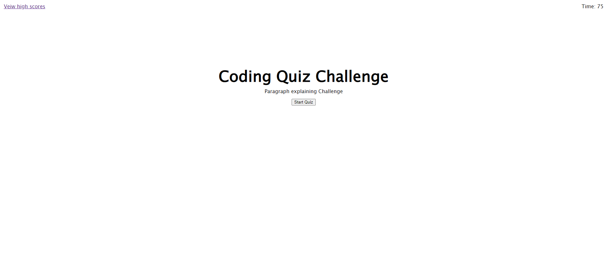

# Coding-Quiz 

## Description

this project generates a quiz when you click the start button. the quiz is timed and it stored the users score in local starge and displays all the scores in local storage on a high scroes page

## Table of Contents

- [Installation](#installation)
- [Usage](#usage)
- [License](#license)
- [Contributing](#contributing)
- [Tests](#tests)
- [Questions](#questions)

## Installation

none

## Usage

click the start quiz botton and click on the answer you think are correct. enter your initials when you finish

Screenshot1
Screenshot2
Screenshot3
## License

No license

## Contributing

I worked with Marcuz Paccapaniccia on this project. his github is https://github.com/mpacct

## Tests

there are no test

## Questions

Github username: [nickrosales](https://www.github.com/nickrosales)

Deployed webpage: https://nickrosales.github.io/Coding-Quiz/

Email: nickrosales68@gmail.com

  